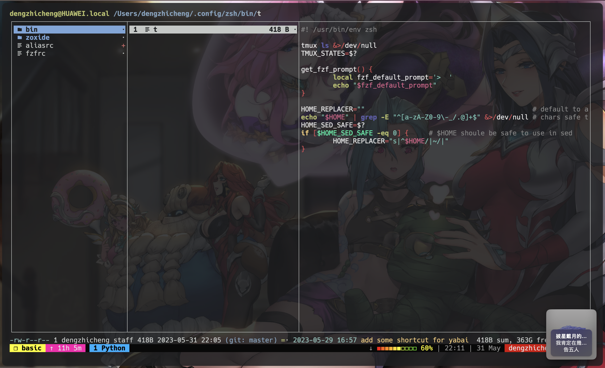

# 我的配置文件



这是我的配置文件仓库，包含的软件有zsh、tmux、ranger、lazygit、fzf、yabai等相关配置。

## 软件

- 桌面管理软件: [yabai](https://github.com/koekeishiya/yabai)
- 快捷键守护进程: [skhd](https://github.com/koekeishiya/skhd)
- Shell提示符美化: [starship](https://github.com/starship/starship)
- 终端: [Alacritty](https://github.com/alacritty/alacritty)
- Git: [lazygit](https://github.com/jesseduffield/lazygit)
- 终端多路复用: [tmux](https://github.com/tmux/tmux)
- 终端文件管理器: [ranger](https://github.com/ranger/ranger)
- 音乐插件: [Sleeve](https://replay.software/sleeve)

## 准备工作

### tmux

相关安装配置如下:

```shell
# install tmux
brew install tmux

# pretty tmux
git clone https://github.com/gpakosz/.tmux.git "$HOME/.config/tmux"
ln -s "/path/to/oh-my-tmux/.tmux.conf" "$HOME/tmux/tmux.conf"
```

### ranger

相关安装如下:

```shell
# install ranger
brew install ranger

# preview windows syntax highlighting
brew install highlight
```

### yabai

[yabai](https://github.com/koekeishiya/yabai)是MacOS的平铺桌面管理软件，相比于`BetterTouch Tool`
等付费的桌面管理软件，更加符合工作流。

#### 关闭MacOS的SIP

安装yabai之前，需要关闭Mac的[SIP](https://github.com/koekeishiya/yabai/wiki/Disabling-System-Integrity-Protection)
(System Integrity Protection)。

#### 安装yabai

通过`Homebrew`进行安装，安装代码如下：

```shell
brew install koekeishiya/formulae/yabai
```

#### yabai的简单使用

相关的简单使用

```shell
# 启动yabai服务
yabai --start-service

# 关闭yabai服务
yabai --stop-service

# 重启yabai服务
yabai --restart-service
```

### skhd

[skhd](https://github.com/koekeishiya/skhd)是MacOS的快捷键守护进程，通常配合
yabai使用。

#### 安装skhd

通过`Homebrew`进行安装，安装代码如下：

```shell
brew install koekeishiya/formulae/skhd
```

#### skhd的简单使用

相关的简单使用

```shell
# 启动skhd服务
skhd --start-service

# 关闭skhd服务
skhd --stop-service

# 重启skhd服务
skhd --restart-service
```

### starship

[starship](https://github.com/starship/starship)是一个可以定制化的Shell提示符主题。

#### 安装starship

通过`Homebrew`进行安装，安装代码如下：

```shell
brew install starship
```

#### 修改starship配置文件路径

将以下环境变量添加到Shell配置文件中，zsh建议添加到`~/.zprofile`中。

```shell
export STARSHIP_CONFIG=~/example/non/default/path/starship.toml
```

### Alacritty

通过`Homebrew`进行安装,安装代码如下:

```shell
brew install --cask alacritty
```

### lazygit

通过`Homebrew`进行安装,安装代码如下:

```shell
brew install lazygit

# 修改配置文件路径,添加到~/.zprofile中
export XDG_CONFIG_HOME="$HOME/.config"
```

### Smart switch tmux session

这是一个Shell脚本命令,可以快速的切换Tmux session,通过`t -help`查看更多细节.
需要依赖[zoxide](https://github.com/ajeetdsouza/zoxide), fzf, tmux和fd.

```Shell
# install zoxide
brew install zoxide

# install fd
brew install fd
```
