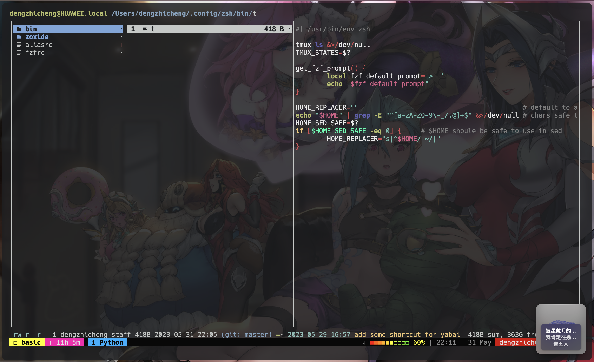

# 我的配置文件



macOS dotfiles 仓库，通过 `quickstart.sh` 一键安装。

## 软件

- 桌面管理: [yabai](https://github.com/koekeishiya/yabai)
- 快捷键守护进程: [skhd](https://github.com/koekeishiya/skhd)
- 终端: [Alacritty](https://github.com/alacritty/alacritty)
- 终端多路复用: [tmux](https://github.com/tmux/tmux) + [sesh](https://github.com/joshmedeski/sesh)
- Shell: zsh + [ohmyzsh](https://github.com/ohmyzsh/ohmyzsh)
- Shell 提示符: [starship](https://github.com/starship/starship)
- 文件管理器: [yazi](https://github.com/sxyazi/yazi)
- Git: [lazygit](https://github.com/jesseduffield/lazygit) + [git-delta](https://github.com/dandavison/delta)
- 编辑器: [Neovim](https://github.com/neovim/neovim)
- 输入法: [Rime](https://rime.im/) + [雾凇拼音](https://github.com/iDvel/rime-ice)
- 启动器: [Raycast](https://www.raycast.com)
- 包管理: [Homebrew](https://brew.sh)
- 历史搜索: [mcfly](https://github.com/cantino/mcfly)
- 目录跳转: [zoxide](https://github.com/ajeetdsouza/zoxide)
- 系统监控: [btop](https://github.com/aristocratos/btop)

## 快速安装

```shell
git clone https://github.com/zh1C/.config.git "$HOME/.config"
cd $HOME/.config
zsh ./quickstart.sh
```

安装完成后需要手动执行：

1. 更新 yabai sudoers hash: `upyabai`
2. 更新 Rime `installation.yml` 中的 `sync_dir`
3. 如果 Rime 无法使用，注销重新登录

## 目录结构

```
.config/
├── alacritty/      # 终端配置
├── btop/           # 系统监控配置
├── ideavim/        # JetBrains Vim 插件配置
├── install/        # 安装脚本
├── lazygit/        # lazygit 配置
├── rimeconf/       # Rime 输入法配置
├── sesh/           # tmux session manager 配置
├── skhd/           # 快捷键配置
├── starship/       # Shell 提示符配置
├── tmux/           # tmux 配置
├── tools/          # 自定义工具脚本
├── yabai/          # 窗口管理配置
├── yazi/           # 文件管理器配置
└── zsh/            # Shell 配置
```

## yabai + skhd

关闭 SIP 后安装，快捷键见 `skhd/skhdrc`。

```shell
# 服务管理
yabai --start-service
yabai --restart-service
skhd --start-service
skhd --restart-service
```

## tmux

prefix 键为 `Ctrl-S`，session 切换使用 `prefix + T`（sesh）。
